  

  
  
  

  
  
  
  
  

  
  
  

---

# 👨‍💻 About Me

I'm a B.Tech CSE (AI) student and software developer focused on building practical applications, AI-powered products, and full-stack systems.

Currently strengthening my foundations in **Java, DSA, backend engineering, and system design** while building products that solve real problems.

---

# 🛠️ Tech Stack

<table align="center">
<tr>
<td align="center" width="25%">

### 💻 Languages

</td>

<td align="center" width="25%">

### 🎨 Frontend

</td>

<td align="center" width="25%">

### ⚙️ Backend & DB

</td>

<td align="center" width="25%">

### 🧰 Tools

</td>
</tr>
</table>
---

# 🐍 Contribution Snake

  <picture>
    <source
      media="(prefers-color-scheme: dark)"
      srcset="https://raw.githubusercontent.com/B2Aryan/B2Aryan/output/github-snake-dark.svg"
    />
    <source
      media="(prefers-color-scheme: light)"
      srcset="https://raw.githubusercontent.com/B2Aryan/B2Aryan/output/github-snake.svg"
    />
    
  </picture>

---

# 🚀 Featured Projects

  <i>Selected projects where I turn ideas into working software.</i>

---

<h3>🚀 ResumePilot — AI Resume Analyzer</h3>

  An <b>AI-powered resume analysis platform</b> that helps job seekers evaluate ATS compatibility, improve their resumes, and identify better job matches.

  
  
  
  

**Highlights:** ATS Scoring · Resume Analysis · Job Matching · AI Recommendations

---

<h3>🔵 FormSahay — Government Form Assistant</h3>

  An <b>AI-assisted platform</b> that simplifies complex government forms through OCR, intelligent guidance, eligibility assistance, and multilingual support.

  
  
  
  

**Highlights:** OCR Processing · Form Guidance · Eligibility Assistance · Multilingual Support

---

<h3>💼 K A Gupta & Associates</h3>

  A <b>production client website</b> developed for a Chartered Accountant firm, focused on lead generation, enquiries, appointments, and discoverability.

  
  
  
  

**Highlights:** Enquiry Workflows · Appointments · Resend Integration · SEO · Analytics

---

<h3>🌆 Symbiotic City 2070</h3>

  A <b>futuristic smart-city visualization</b> created for the Copilot Jam Hackathon, exploring interactive urban infrastructure and future-city concepts.

  
  
  

**Highlights:** Interactive Visualization · Smart City Concepts · Futuristic UI

🏆 **Copilot Jam Hackathon — Winner**

---

<h3>💳 Razorpay Clone</h3>

  A <b>responsive frontend recreation</b> built to strengthen UI architecture, responsive layouts, and modern frontend development.

  
  
  

**Highlights:** Responsive UI · Modern Design · Tailwind CSS · Cross-device Layout

---

# 📜 Certifications

  
  
  
  
  
  

---

<h2>🔥 GitHub Daily Streak</h2>

  

---

# 📊 GitHub Statistics

  
  

---

# 📈 GitHub Activity

  

---

# 🤝 Let's Connect

  
  
  
  

  <i>Building useful software, one commit at a time.</i>

  

