  

  

  
  
  

  
  
  
  

  
  
  

---

# 👨‍💻 About Me

I'm a B.Tech CSE (AI) student and software developer focused on building practical applications, AI-powered products, and full-stack systems.

Currently strengthening my foundations in **Java, DSA, backend engineering, and system design** while building products that solve real problems.

---

# 🛠️ Tech Stack

  

  

  

  

---

# 🚀 Featured Projects

### 🚀 ResumePilot — AI Resume Analyzer

AI-powered resume analysis platform for ATS-style scoring, resume optimization, job matching, and AI recommendations.

**Tech:** React · TypeScript · AI · Resume Parsing

[Repository](https://github.com/B2Aryan/Resume_Analyzer_Project)

---

### 📝 FormSahay — Government Form Assistant

AI-assisted platform designed to simplify complex government forms through OCR, intelligent guidance, eligibility assistance, and multilingual support.

**Tech:** React · OCR · AI

[Repository](https://github.com/B2Aryan/FormSahay_Portal)

---

### 💼 K A Gupta & Associates

Production website developed and deployed for a Chartered Accountant firm.

**Tech:** React · TypeScript · MongoDB

**Features:** Enquiry workflows · Appointment handling · Resend · SEO · Analytics

[Live Website](https://kaguptaassociates.vercel.app/)

---

### 🌆 Symbiotic City 2070

Futuristic smart-city visualization developed for the Copilot Jam Hackathon.

**Tech:** HTML · CSS · JavaScript

🏆 **Copilot Jam Hackathon — Winner**

[Live Demo](https://symbiotic-city-model-2070-1w7x.vercel.app/)

---

### 💳 Razorpay Clone

Responsive frontend recreation built to strengthen UI architecture and responsive design skills.

**Tech:** HTML · CSS · Tailwind CSS

[Repository](https://github.com/B2Aryan/Razorpay-Clone)

---

# 🏆 Achievements

- 🥇 **Copilot Jam Hackathon Winner** — Public Opinion Category
- 💼 **Production Client Project** — Delivered website for a CA firm
- 🤖 **AI Product Builder** — ResumePilot & FormSahay
- 🌐 **Full Stack Developer** — Multiple end-to-end applications

---

# 📜 Certifications

  
  
  
  
  
  

---

# 🏆 GitHub Trophies

  

---

# 📊 GitHub Statistics

  
  

---

# 📈 GitHub Activity

  

---

# 🤝 Let's Connect

  
  
  
  

  <i>Building useful software, one commit at a time.</i>

  

